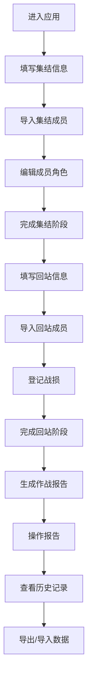

# EVE作战记录工具 - 产品需求文档（PRD）

## 1. 产品概览

EVE作战记录工具是一款专为EVE Online游戏玩家设计的Web应用，用于高效记录和管理舰队作战全流程，包括集结、回站、战损统计及报告生成。

- **核心价值**：简化舰队作战记录流程，提供标准化的作战报告，帮助指挥和成员快速追踪作战数据。
- **目标用户**：EVE Online游戏中的舰队指挥（FC）、后勤人员及需要记录作战数据的玩家。
- **应用场景**：联盟集结、战略行动、本土防御、漫游扫荡等各类舰队作战活动。

## 2. 核心功能

### 2.1 功能模块

| 模块名称 | 功能描述 | 优先级 |
|---------|---------|--------|
| **集结管理** | 舰队信息填写、成员导入与管理、角色分配、舰队统计 | P0 |
| **回站核实** | 回站信息记录、成员核实、战损登记与匹配 | P0 |
| **报告生成** | 自动生成作战报告、报告导出与分享、历史记录管理 | P0 |
| **数据管理** | 历史记录存储、JSON导入导出、数据重置 | P1 |

### 2.2 详细功能规格

#### 2.2.1 集结管理模块

| 功能点 | 描述 | 验收标准 |
|--------|------|----------|
| 舰队信息填写 | 支持选择舰队类型（联盟集结、战略行动等）、输入集结地点、FC名称、预期目标 | 所有字段可正常输入并保存 |
| 成员导入 | 支持批量粘贴成员名单（格式：角色名*舰船），自动解析并生成成员列表 | 粘贴后正确解析成员信息，无格式错误 |
| 手动添加成员 | 支持手动输入单个成员信息（角色名*舰船） | 手动输入后成员信息正确添加到列表 |
| 成员角色编辑 | 支持为成员分配角色（火力、后勤、拦截、侦查、电子），可修改和删除成员 | 角色分配后统计数据实时更新，删除操作生效 |
| 舰队统计 | 实时统计各角色成员数量及总人数 | 统计数据与成员列表一致，实时更新 |
| 快捷标签 | 支持选择多个标签（如PAP、CTA、SRP等）标记作战类型 | 标签选择后正确保存，显示在报告中 |

#### 2.2.2 回站核实模块

| 功能点 | 描述 | 验收标准 |
|--------|------|----------|
| 回站信息记录 | 自动生成回站时间，支持输入返回地点和作战摘要 | 时间自动填充，地点和摘要可正常输入 |
| 回站成员导入 | 支持粘贴回站成员名单，与集结名单对比核实 | 导入后正确解析，与集结名单匹配 |
| 战损登记 | 支持粘贴KM链接，自动解析并匹配战损成员 | KM链接解析正确，战损成员匹配准确 |
| 战损统计 | 自动计算未回站成员，标记为战损 | 战损名单与实际未回站成员一致 |

#### 2.2.3 报告生成模块

| 功能点 | 描述 | 验收标准 |
|--------|------|----------|
| 自动生成报告 | 根据集结、回站、战损数据生成标准化作战报告 | 报告内容完整，格式规范 |
| 报告操作 | 支持一键复制报告内容、保存报告到本地 | 复制功能正常，保存文件可打开 |
| 历史记录管理 | 自动保存历史作战记录，支持查看历史报告 | 历史记录正确保存，可查看详情 |
| 数据导入导出 | 支持导出历史记录为JSON，导入JSON恢复历史 | 导出文件格式正确，导入后数据完整 |

## 3. 核心流程

### 3.1 用户操作流程



### 3.2 数据流转

1. **集结阶段**：用户填写基本信息 → 导入成员 → 系统解析成员数据 → 生成集结成员列表
2. **回站阶段**：用户填写回站信息 → 导入回站成员 → 系统对比集结与回站名单 → 生成战损列表
3. **报告阶段**：系统整合所有数据 → 生成标准化报告 → 提供报告操作选项

## 4. 用户界面设计

### 4.1 设计风格

- **主色调**：深蓝色（#00d4ff）搭配深色背景（#0a0e1a），符合EVE Online游戏风格
- **辅助色**：红色（火力）、绿色（后勤）、黄色（拦截）、青色（侦查）、紫色（电子）
- **字体**：Segoe UI、Microsoft YaHei，确保中文显示正常
- **布局**：响应式设计，模块化面板布局，三阶段导航

### 4.2 页面详情

| 页面/模块 | 布局描述 | 关键元素 |
|-----------|---------|----------|
| **集结页面** | 顶部信息填写区，中部成员导入区，底部成员编辑区 | 舰队类型选择器、成员导入文本框、成员表格、角色选择器 |
| **回站页面** | 顶部回站信息区，中部成员导入区，底部战损登记区 | 回站时间显示、作战摘要文本域、KM链接输入框 |
| **报告页面** | 顶部报告显示区，中部操作按钮区，底部历史记录区 | 报告输出框、操作按钮组、历史记录列表 |

### 4.3 响应式设计

- **桌面端**：三阶段并排显示，完整功能布局
- **平板端**：三阶段垂直排列，保持核心功能
- **移动端**：单阶段显示，通过导航切换，简化操作流程

## 5. 技术规格

### 5.1 技术栈

| 类别 | 技术/工具 | 版本要求 |
|------|-----------|----------|
| **前端** | HTML5, CSS3, 原生JavaScript | 现代浏览器支持 |
| **存储** | localStorage | 浏览器内置 |
| **部署** | 静态网站 | 无需后端服务 |

### 5.2 数据模型

#### FleetOperation（作战行动）
```javascript
{
  id: String,           // 唯一标识符
  fcName: String,       // 舰队指挥名称
  location: String,     // 集结地点
  fleetType: String,    // 舰队类型
  target: String,       // 预期目标
  formTime: String,     // 集结时间
  rtbTime: String,      // 回站时间
  rtbLocation: String,  // 返回地点
  combatSummary: String, // 作战摘要
  tags: Array,          // 快捷标签
  formMembers: Array,   // 集结成员
  rtbMembers: Array,    // 回站成员
  lossMembers: Array    // 战损成员
}
```

#### Member（成员）
```javascript
{
  name: String,         // 成员名称
  ship: String,         // 舰船类型
  role: String          // 角色类型
}
```

### 5.3 性能要求

- **加载时间**：首次加载时间 ≤ 2秒
- **响应速度**：操作响应时间 ≤ 500ms
- **存储限制**：历史记录存储 ≤ 5MB（localStorage默认限制）

## 6. 验收标准

### 6.1 功能验收

| 功能点 | 验收标准 | 测试方法 |
|--------|----------|----------|
| 成员导入 | 支持批量粘贴成员名单，正确解析格式 | 粘贴测试数据，检查解析结果 |
| 角色分配 | 成员角色可编辑，统计数据实时更新 | 修改角色，检查统计变化 |
| 战损匹配 | 导入回站成员后，正确标记战损成员 | 对比集结与回站名单，验证战损列表 |
| 报告生成 | 生成报告内容完整，格式规范 | 检查报告输出内容和格式 |
| 历史记录 | 历史记录正确保存和显示 | 多次操作后检查历史记录完整性 |
| 数据导入导出 | JSON导入导出功能正常 | 导出后再导入，验证数据一致性 |

### 6.2 兼容性验收

| 浏览器 | 版本要求 | 测试要点 |
|--------|----------|----------|
| Chrome | ≥ 90 | 功能完整，响应正常 |
| Firefox | ≥ 88 | 功能完整，响应正常 |
| Edge | ≥ 90 | 功能完整，响应正常 |
| Safari | ≥ 14 | 功能完整，响应正常 |

## 7. 项目风险

| 风险点 | 影响程度 | 应对措施 |
|--------|----------|----------|
| 浏览器存储限制 | 中 | 实现自动清理旧记录机制，提示用户定期导出备份 |
| 成员导入格式错误 | 低 | 提供格式示例和错误提示，支持手动编辑修正 |
| KM链接解析失败 | 低 | 提供手动添加战损成员功能，增强错误处理 |
| 响应式适配问题 | 低 | 针对主流设备进行测试，确保核心功能在各设备正常使用 |

## 8. 项目范围限定

- **仅支持**：EVE Online游戏作战记录，不涉及其他游戏
- **仅支持**：静态数据管理，无实时数据同步
- **仅支持**：本地存储，无云端备份（需用户手动导出）
- **不支持**：多用户协作，仅限单用户使用

## 9. 交付物

1. **产品需求文档**：本PRD文档
2. **功能原型**：HTML/CSS/JS实现的完整应用
3. **使用说明**：详细的用户操作指南
4. **测试报告**：功能和兼容性测试结果

## 10. 项目时间线

| 阶段 | 时间估计 | 主要任务 |
|------|----------|----------|
| **需求分析** | 1天 | 整理需求，编写PRD |
| **设计与开发** | 3天 | 界面设计，功能实现 |
| **测试与优化** | 1天 | 功能测试，兼容性测试，性能优化 |
| **交付与部署** | 1天 | 最终检查，部署上线 |

---

**备注**：本PRD基于现有代码结构和功能进行整理，确保与实际实现保持一致。开发团队可根据此文档进行功能验证和测试，确保产品质量符合预期。